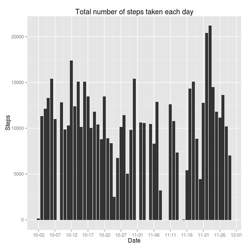
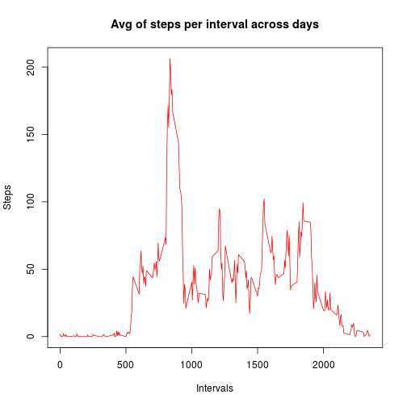
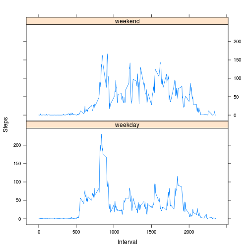

Assignment-1 of Reproducible Research
========================================================


```r
opts_chunk$set(echo=TRUE)
```

## Loading and preprocessing the data

1.Load the data (i.e. read.csv())

```r
act <- read.csv("activity.csv")
```

## What is mean total number of steps taken per day?

### Make a histogram of the total number of steps taken each day

```r
library(ggplot2)
library(scales)
histogram <- qplot(x=as.Date(date), y=steps, data=subset(act, complete.cases(act)), stat='summary', fun.y=sum, geom="bar") + labs(title='Total number of steps taken each day', y='Steps', x='Date') + scale_x_date(labels = date_format("%m-%d"), breaks="5 days")
plot(histogram)
```

 


### mean and median total number of steps taken per day

```r
x <- na.omit(act)
tmp <- x[,1:2]
aggdata <- aggregate(steps ~ date, tmp, function(x) sum(as.numeric(x)))
smean <- mean(aggdata$steps)
smedian <- median(aggdata$steps)
```

- Mean total number of steps per day: **1.0766 &times; 10<sup>4</sup>**
- Median total number of steps per day: **1.0765 &times; 10<sup>4</sup>**

## Average daily activity pattern

Time series plot (i.e. type = "l") of the 5-minute interval (x-axis) and the average number of steps taken, averaged across all days (y-axis)

```r
x <- na.omit(act)
dat <- aggregate(steps ~ interval, x, function(z) mean(as.numeric(z)))
plot(dat$interval, dat$steps, type="l", col="red", xlab="Intervals", ylab="Steps", main="Avg of steps per interval across days")
```

 

Which 5-minute interval, on average across all the days in the dataset, contains the maximum number of steps?

```r
index <- which.max(dat[,2])
interval <- dat[index,1]
maxSteps <- dat[index,2]
```
- required interval: **835**
- max Steps in above interval: **206.1698**

## Imputing missing values


```r
na <- which(is.na(act))
len <- length(na)
```
- total number of missing values in the dataset: **2304**

#### Missing values are filled in with the mean for that 5-minute interval.
We are taking a strategy for filling the missing values with the mean of corresponding
5-minute interval.

```r
x <- na.omit(act)
dat <- aggregate(steps ~ interval, x, function(z) mean(as.numeric(z)))
count <- 0
for (i in 1:nrow(act)) {
  if(is.na(act[i,1])) {
    act[i,1] <- dat[which(dat[,1] == act[i,3]),2]
    count <- count+1
  }
}
```
- Total values replaced: **2304**
- The dataset "dat" is now having missing values filled in.


```r
library(ggplot2)
library(scales)
histogram <- qplot(x=as.Date(date), y=steps, data=subset(act, complete.cases(act)), stat='summary', fun.y=sum, geom="bar") + labs(title='Total number of steps taken each day', y='Steps', x='Date') + scale_x_date(labels = date_format("%m-%d"), breaks="5 days")
plot(histogram)
```

 

### mean and median total number of steps taken per day

```r
tmp <- act[,1:2]
aggdata <- aggregate(steps ~ date, tmp, function(x) sum(as.numeric(x)))
smean <- mean(aggdata$steps)
smedian <- median(aggdata$steps)
```

- Mean total number of steps per day: **1.0766 &times; 10<sup>4</sup>**
- Median total number of steps per day: **1.0766 &times; 10<sup>4</sup>**

Here we see that the impact of replacing the missing values is negligible on **mean** and **median** of the total steps taken per day.
Mean is almost same and Median is off by 1 unit from the previous Median.

## Activity patterns between weekdays and weekends?
Make a panel plot containing a time series plot (i.e. type = "l") of the 5-minute interval (x-axis) and the average number of steps taken, averaged across all weekday days or weekend days (y-axis). 


```r
library(lattice)
df <- act
df$day <- factor(format(as.Date(act$date), "%A"))

levels(df$day) <- list(weekday = c("Monday", "Tuesday", "Wednesday", "Thursday",    "Friday"), weekend=c("Saturday", "Sunday"))
data <- aggregate(df$steps, by=list(df$interval, df$day), mean)
names(data) <- c("Interval", "Day", "Steps")
xyplot(Steps ~ Interval | Day, data=data, layout=c(1,2), type="l" )
```

 
