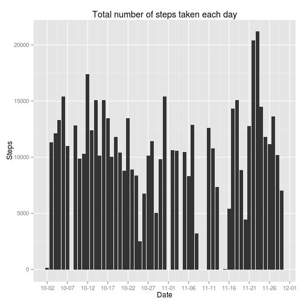
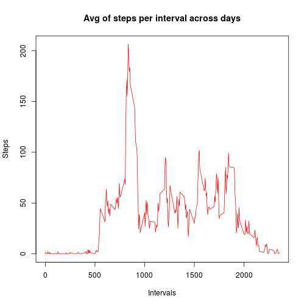
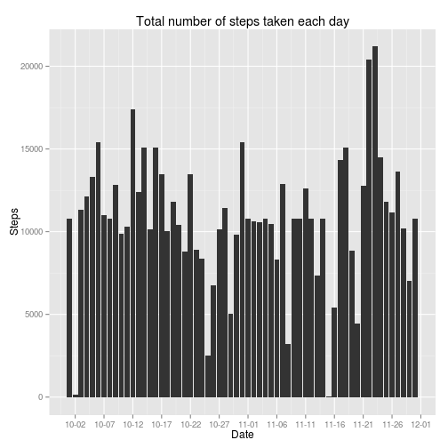
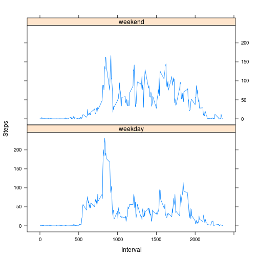

Assignment-1 of Reproducible Research
========================================================

Setting the echo for code chunks as TRUE globally.

```r
opts_chunk$set(echo=TRUE)
```

## Loading and preprocessing the data

1.Load the data (i.e. read.csv())

```r
act <- read.csv("activity.csv")
```

2.Process/transform the data (if necessary) into a format suitable for your analysis

From step 1. we have the data in data.frame format which is good enough for our analysis

```r
class(act)
```

```
## [1] "data.frame"
```

```r
head(act)
```

```
##   steps       date interval
## 1    NA 2012-10-01        0
## 2    NA 2012-10-01        5
## 3    NA 2012-10-01       10
## 4    NA 2012-10-01       15
## 5    NA 2012-10-01       20
## 6    NA 2012-10-01       25
```

## What is mean total number of steps taken per day?

### Make a histogram of the total number of steps taken each day

```r
library(ggplot2)
library(scales)
##Below we are removing the rows with "NA" using subset 
##plotting the graph with a frequency of 5 days
histogram <- qplot(x=as.Date(date), y=steps, data=subset(act, complete.cases(act)), stat='summary', fun.y=sum, geom="bar") + labs(title='Total number of steps taken each day', y='Steps', x='Date') + scale_x_date(labels = date_format("%m-%d"), breaks="5 days")
plot(histogram)
```

 


### mean and median total number of steps taken per day

```r
x <- na.omit(act)
tmp <- x[,1:2]
aggdata <- aggregate(steps ~ date, tmp, function(x) sum(as.numeric(x)))
smean <- mean(aggdata$steps)
smedian <- median(aggdata$steps)
smean
```

```
## [1] 10766
```

```r
smedian
```

```
## [1] 10765
```

- Mean total number of steps per day: **1.0766 &times; 10<sup>4</sup>**
- Median total number of steps per day: **1.0765 &times; 10<sup>4</sup>**

## What is the average daily activity pattern?

Time series plot (i.e. type = "l") of the 5-minute interval (x-axis) and the average number of steps taken, averaged across all days (y-axis)

```r
x <- na.omit(act)
dat <- aggregate(steps ~ interval, x, function(z) mean(as.numeric(z)))
plot(dat$interval, dat$steps, type="l", col="red", xlab="Intervals", ylab="Steps", main="Avg of steps per interval across days")
```

 

Which 5-minute interval, on average across all the days in the dataset, contains the maximum number of steps?

```r
index <- which.max(dat[,2])
interval <- dat[index,1]
maxSteps <- dat[index,2]
```
- required interval: **835**
- max Steps in above interval: **206.1698**

## Imputing missing values


```r
na <- which(is.na(act))
len <- length(na)
```
- total number of missing values in the dataset: **2304**

#### Missing values are filled in with the mean for that 5-minute interval.
The strategy for filling the missing values is to replace it with the mean of corresponding 5-minute interval.


```r
x <- na.omit(act)
dat <- aggregate(steps ~ interval, x, function(z) mean(as.numeric(z)))
count <- 0
## Ideally I should be doing below without using loops.
for (i in 1:nrow(act)) {
  if(is.na(act[i,1])) {
    act[i,1] <- dat[which(dat[,1] == act[i,3]),2]
    count <- count+1
  }
}
head(act)
```

```
##     steps       date interval
## 1 1.71698 2012-10-01        0
## 2 0.33962 2012-10-01        5
## 3 0.13208 2012-10-01       10
## 4 0.15094 2012-10-01       15
## 5 0.07547 2012-10-01       20
## 6 2.09434 2012-10-01       25
```
- Total values replaced: **2304**
- The dataset "dat" is now having missing values filled in.


```r
library(ggplot2)
library(scales)
histogram <- qplot(x=as.Date(date), y=steps, data=subset(act, complete.cases(act)), stat='summary', fun.y=sum, geom="bar") + labs(title='Total number of steps taken each day', y='Steps', x='Date') + scale_x_date(labels = date_format("%m-%d"), breaks="5 days")
plot(histogram)
```

 

### mean and median total number of steps taken per day

```r
tmp <- act[,1:2]
aggdata <- aggregate(steps ~ date, tmp, function(x) sum(as.numeric(x)))
smean <- mean(aggdata$steps)
smedian <- median(aggdata$steps)
smean
```

```
## [1] 10766
```

```r
smedian
```

```
## [1] 10766
```

- Mean total number of steps per day: **1.0766 &times; 10<sup>4</sup>**
- Median total number of steps per day: **1.0766 &times; 10<sup>4</sup>**

Here we see that the impact of replacing the missing values is negligible on **mean** and **median** of the total steps taken per day.
Mean is almost same and Median is off by 1 unit from the previous Median.

## Are there differences in activity patterns between weekdays and weekends?
Making a panel plot containing a time series plot (i.e. type = "l") of the 5-minute interval (x-axis) and the average number of steps taken, averaged across all weekday days or weekend days (y-axis). 


```r
library(lattice)
df <- act
##add another column specifying weekday as factor
df$day <- factor(format(as.Date(act$date), "%A"))

##Create the "weekday" and "weekend" levels.
levels(df$day) <- list(weekday = c("Monday", "Tuesday", "Wednesday", "Thursday",    "Friday"), weekend=c("Saturday", "Sunday"))

##aggregating the "steps" data based on "interval" and "day" type based on mean function
data <- aggregate(df$steps, by=list(df$interval, df$day), mean)

##fix the names of the columns
names(data) <- c("Interval", "Day", "Steps")

xyplot(Steps ~ Interval | Day, data=data, layout=c(1,2), type="l" )
```

 

```r
head(data)
```

```
##   Interval     Day   Steps
## 1        0 weekday 2.25115
## 2        5 weekday 0.44528
## 3       10 weekday 0.17317
## 4       15 weekday 0.19790
## 5       20 weekday 0.09895
## 6       25 weekday 1.59036
```

```r
levels(data$Day)
```

```
## [1] "weekday" "weekend"
```

Thanks for reading the report - Best Wishes :)
